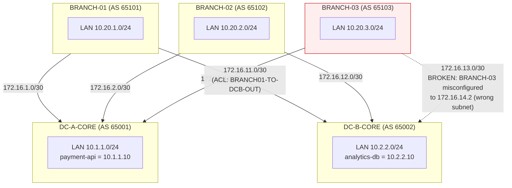

# Network Project

Generates real Cisco device configs from simple YAML data, then verifies them
with [Batfish](https://www.batfish.org/) — a network configuration analysis
engine — before anything would ever touch a real router.

## Topology

5 devices: two datacenter cores (each fronting a real internal service) and
three branch offices, each dual-homed to both cores over eBGP.



The dashed red link is a live, currently-uncommitted demo bug: BRANCH-03's
WAN interface toward DC-B-CORE was deliberately misconfigured with an IP on
the wrong subnet, breaking that eBGP session. See "Real findings" below.

## Architecture

```
configs/vars/*.yml  --(render_configs.py + Jinja2)-->  configs/rendered/*.cfg
                                                                |
                                                         (Batfish snapshot)
                                                                |
                                                    Docker: batfish/allinone
                                                     (localhost:9996/9997)
                                                                |
                                                  pybatfish queries, run by
                                                 a Claude Code session with
                                                    Bash access, on request
```

- **`configs/vars/*.yml`** — human-edited facts about each device (hostname, interfaces, ACLs, BGP neighbors). The only files you ever hand-edit.
- **`configs/templates/router.conf.j2`** — one Jinja2 template, shared by all 5 devices, that turns those facts into real Cisco IOS syntax.
- **`render_configs.py`** — does the substitution, and runs every ACL through `core/acl_parser.py` for a syntax check before writing anything.
- **`core/acl_parser.py`** — a hand-written Cisco extended-ACL parser and packet-matching simulator (no Batfish, no LLM). Catches typos; does *not* catch rule-ordering/shadowing bugs (see below for why that matters).
- **`core/subnet_utils.py`** — standalone IP-math helpers (overlap detection, next-free-subnet allocation, CIDR summarization).
- **Batfish** (Docker, `batfish/allinone`) — reads the rendered `.cfg` files and builds a real model of network behavior: BGP session state, ACL/filter behavior, end-to-end reachability — for every possible packet, not one at a time.
- **`agent/infer_intent.py`** — reads a `git diff` of `configs/vars/*.yml` and infers what an uncommitted change was trying to do, without anyone typing an intent sentence. An added ACL rule with a `remark` right above it counts as a real, human-stated intent (`[stated]`); anything else is reported as a plain structural diff (`[inferred]`), clearly labeled as a guess rather than a known intent.
- **Claude** — no separate script or API key. Whoever has a Claude Code session open in this folder (your existing subscription) takes that inferred (or directly stated) intent, writes the pybatfish query itself, runs it against the live Batfish container, and explains the real result.

## Real findings this project has actually caught

**1. A shadowed ACL rule.** Adding a new `permit udp ... eq 514` rule *after* an
existing catch-all `deny` on BRANCH-01 rendered and parsed fine — no syntax
error — but Batfish's `filterLineReachability` query flagged the new line as
permanently unreachable, and `testFilters` confirmed a simulated packet still
got denied. A text diff would have shown the change; Batfish showed it had
zero actual effect.

**2. A single-sided IP typo breaking BGP, with an unexpected safety net.**
Changing only BRANCH-03's own WAN IP (not touching DC-B-CORE's side) broke
that eBGP session cleanly — confirmed independently by `bgpSessionStatus`
(`NOT_COMPATIBLE`) and `bgpSessionCompatibility` (`NO_LOCAL_IP`). But an
end-to-end `reachability` query showed traffic *still* reaching DC-B-CORE's
LAN — rerouted through DC-A-CORE and then through BRANCH-01, because nothing
in this network's BGP policy stops a branch from accidentally providing
transit between the two datacenter cores. Real latent design gap, found by
asking a completely different question than the one we thought we were
asking.

## Running it yourself

```powershell
python -m venv .venv
.venv\Scripts\pip install -r requirements.txt
.venv\Scripts\python.exe -m pytest          # 17 tests, no Docker needed
.venv\Scripts\python.exe render_configs.py  # regenerate configs/rendered/*.cfg
```

Batfish (needs Docker):
```powershell
docker pull batfish/allinone
docker run -d --name batfish -p 9996:9996 -p 9997:9997 batfish/allinone
```

Then, from a Python session with `pybatfish` installed:
```python
from pybatfish.client.session import Session
bf = Session(host="localhost")
bf.set_network("network-project")
bf.init_snapshot("configs/rendered", name="current", overwrite=True)  # needs a configs/ subfolder — see note below
print(bf.q.filterLineReachability().answer().frame())
```

Note: Batfish requires the snapshot directory to contain a `configs/`
subfolder — copy `configs/rendered/*.cfg` into `<some_dir>/configs/` before
calling `init_snapshot`, don't point it at `configs/rendered` directly.

The Claude-explains-it layer needs no separate setup beyond having a Claude
Code session (your own subscription) open in this repo — just state your
intent to it directly.
